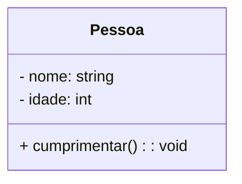
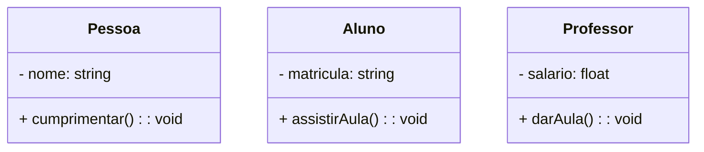
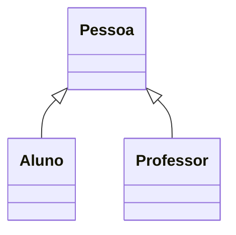
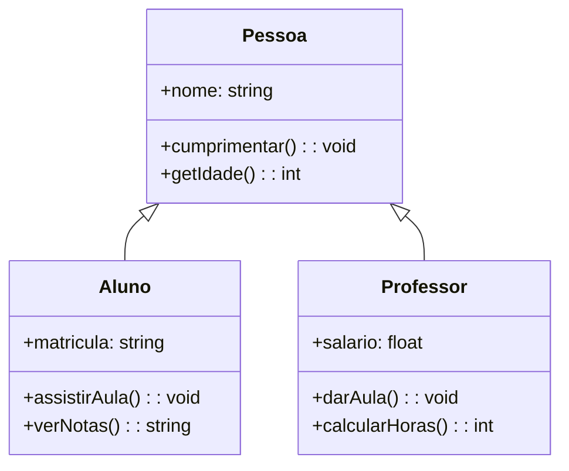
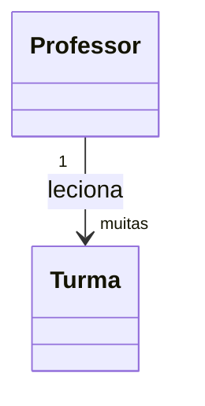
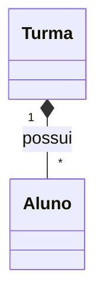
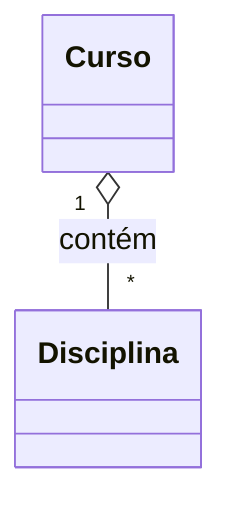
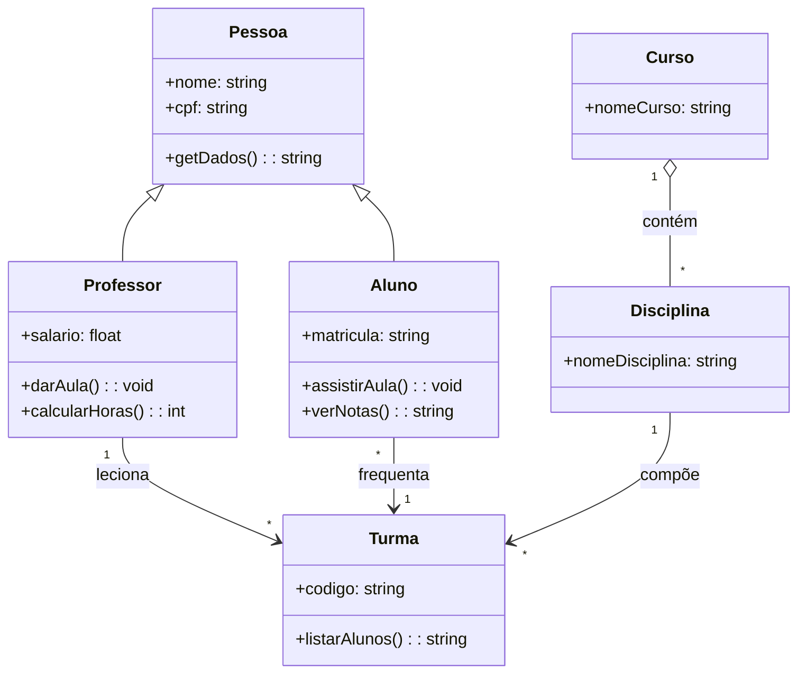
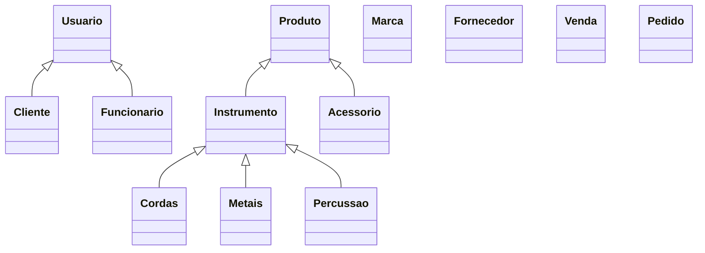

# 🧠 Aula Prática: Diagramas de Classe com Mermaid no GitHub

Aprenda a usar **Mermaid.js** para criar diagramas UML dentro do seu repositório no GitHub. Os diagramas são criados com texto e renderizados automaticamente. Isso facilita a documentação e a manutenção do seu projeto.

---

## Slide 1: Estrutura Básica de uma Classe

### Visualização


### Código
```
classDiagram
  class Pessoa {
    - nome: string
    - idade: int
    + cumprimentar(): void
  }
```

---

## Slide 2: Múltiplas Classes

### Visualização


### Código
```
classDiagram
  class Pessoa {
    - nome: string
    + cumprimentar(): void
  }

  class Aluno {
    - matricula: string
    + assistirAula(): void
  }

  class Professor {
    - salario: float
    + darAula(): void
  }
```

---

## Slide 3: Herança

### Visualização


### Código
```
classDiagram
  class Pessoa
  class Aluno
  class Professor

  Pessoa <|-- Aluno
  Pessoa <|-- Professor
```

---

## Slide 4: Herança com Múltiplos Métodos e Retorno

### Visualização


### Código
```
classDiagram
  class Pessoa {
    +nome: string
    +cumprimentar(): void
    +getIdade(): int
  }

  class Aluno {
    +matricula: string
    +assistirAula(): void
    +verNotas(): string
  }

  class Professor {
    +salario: float
    +darAula(): void
    +calcularHoras(): int
  }

  Pessoa <|-- Aluno
  Pessoa <|-- Professor
```

---

## Slide 5: Associação Simples

### Visualização


### Código
```
classDiagram
  class Professor
  class Turma

  Professor "1" --> "muitas" Turma : leciona
```

---

## Slide 6: Composição (forte)

### Visualização


### Código
```
classDiagram
  class Turma
  class Aluno

  Turma "1" *-- "*" Aluno : possui
```

---

## Slide 7: Agregação (fraca)

### Visualização


### Código
```
classDiagram
  class Curso
  class Disciplina

  Curso "1" o-- "*" Disciplina : contém
```

---

## Slide 8: Diagrama Completo de Exemplo

### Visualização


---

## Slide 9: Dicas para GitHub

- ✅ Use blocos ` ```mermaid ` dentro de arquivos `.md`
- ✅ GitHub renderiza automaticamente
- ⚠️ Evite acentos ou `ç` nos nomes das classes
- ✅ Use o site [https://mermaid.live](https://mermaid.live) para testar

---

## Slide 10: 🧩 Desafio Prático – Loja de Instrumentos Musicais 🎸🥁🎷

Você foi contratado para modelar o sistema de uma loja de instrumentos musicais. Crie um **diagrama de classes UML com Mermaid** respeitando as seguintes exigências:

### ✅ Classes obrigatórias:

- Produto   (criar aquivo Produto.md)
  - Instrumento  
    - Cordas  
    - Metais  
    - Percussão  
  - Acessório  
- Usuário (criar aquivo Usuario.md)
  - Cliente  
  - Funcionário  
- Venda   (criar aquivo Venda.md)
- Pedido  (criar aquivo Pedido.md)
- Fornecedor  (criar aquivo Fornecedor.md)


---

### 🛠️ Regras:

- Cada classe deve ter **ao menos 2 métodos**, sendo **1 com retorno de valor** (`getPreco()`, `buscarItem()`, etc.).
- Use **herança** (`<|--`) sempre que uma classe especializa outra.
- Use **composição** ou **agregação** quando necessário (`*--`, `o--`).
- Utilize associações com multiplicidade entre entidades (ex: Loja vende Produtos, Produto pertence à Marca).
- Mostre a hierarquia clara entre `Usuário`, `Cliente` e `Funcionário`.
- Não copie o exemplo anterior. Modele com **criatividade e lógica real**.

---

### 💡 Dica de Esqueleto (sem atributos/métodos ainda):

````markdown

