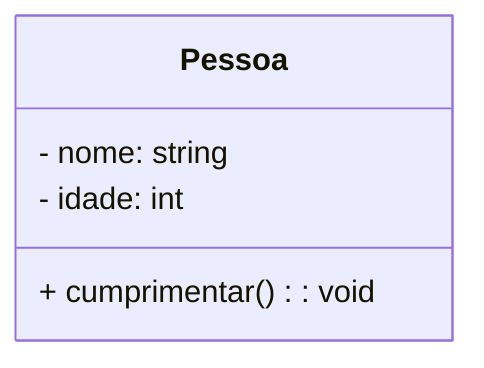
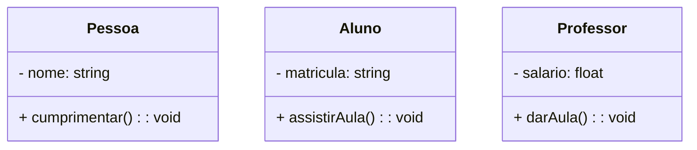
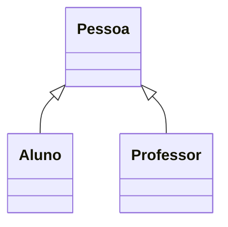
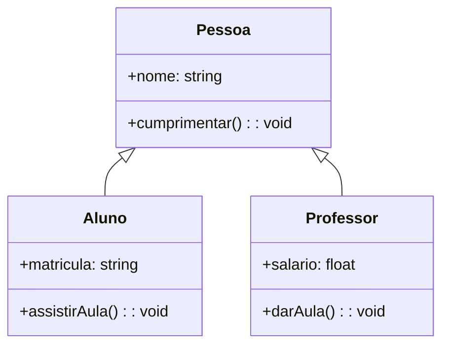
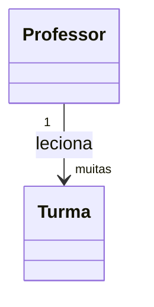
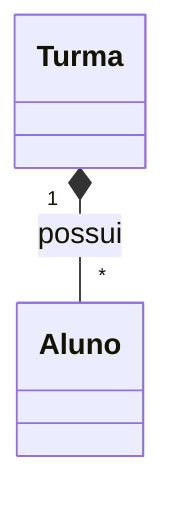
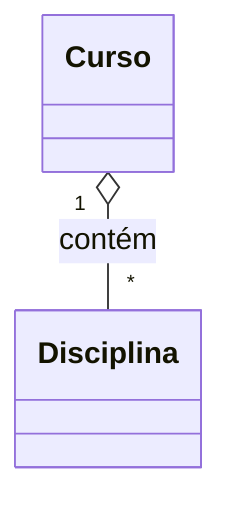
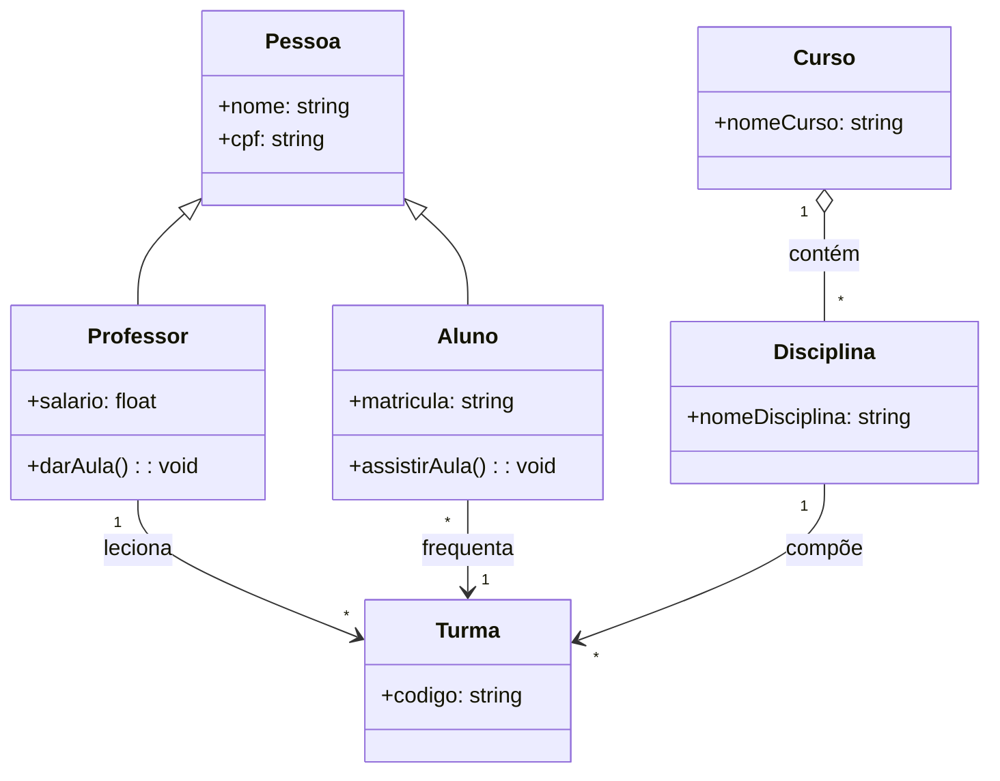

# Aula: Diagramas de Classe com Mermaid no GitHub

## Slide 1: Estrutura Básica de uma Classe

### Visualização


### Código
```
classDiagram
  class Pessoa {
    - nome: string
    - idade: int
    + cumprimentar(): void
  }
```

---

## Slide 2: Múltiplas Classes

### Visualização


### Código
```
classDiagram
  class Pessoa {
    - nome: string
    + cumprimentar(): void
  }

  class Aluno {
    - matricula: string
    + assistirAula(): void
  }

  class Professor {
    - salario: float
    + darAula(): void
  }
```

---

## Slide 3: Herança

### Visualização


### Código
```
classDiagram
  class Pessoa
  class Aluno
  class Professor

  Pessoa <|-- Aluno
  Pessoa <|-- Professor
```

---

## Slide 4: Herança com Métodos

### Visualização


### Código
```
classDiagram
  class Pessoa {
    +nome: string
    +cumprimentar(): void
  }

  class Aluno {
    +matricula: string
    +assistirAula(): void
  }

  class Professor {
    +salario: float
    +darAula(): void
  }

  Pessoa <|-- Aluno
  Pessoa <|-- Professor
```

---

## Slide 5: Associação Simples

### Visualização


### Código
```
classDiagram
  class Professor
  class Turma

  Professor "1" --> "muitas" Turma : leciona
```

---

## Slide 6: Composição (forte)

### Visualização


### Código
```
classDiagram
  class Turma
  class Aluno

  Turma "1" *-- "*" Aluno : possui
```

---

## Slide 7: Agregação (fraca)

### Visualização


### Código
```
classDiagram
  class Curso
  class Disciplina

  Curso "1" o-- "*" Disciplina : contém
```

---

## Slide 8: Diagrama Completo

### Visualização


### Código
```
classDiagram
  class Pessoa {
    +nome: string
    +cpf: string
  }

  class Aluno {
    +matricula: string
    +assistirAula(): void
  }

  class Professor {
    +salario: float
    +darAula(): void
  }

  class Turma {
    +codigo: string
  }

  class Curso {
    +nomeCurso: string
  }

  class Disciplina {
    +nomeDisciplina: string
  }

  Pessoa <|-- Aluno
  Pessoa <|-- Professor

  Professor "1" --> "*" Turma : leciona
  Aluno "*" --> "1" Turma : frequenta
  Curso "1" o-- "*" Disciplina : contém
  Disciplina "1" --> "*" Turma : compõe
```

---

## Slide 9: Dicas para GitHub

- ✅ Use blocos ` ```mermaid ` dentro de arquivos `.md`  
- ✅ GitHub renderiza automaticamente (no navegador)  
- ⚠️ Evite acentos e cedilhas nos nomes dentro do diagrama  
- 🔁 Use o [https://mermaid.live](https://mermaid.live) para testar antes de subir

---

## Slide 10: Exercício para os Alunos

Crie no seu repositório um diagrama Mermaid representando:

- Um sistema de biblioteca  
- Com as classes: `Livro`, `Autor`, `Usuário`, `Empréstimo`  
- Use pelo menos:
  - ✅ 1 herança  
  - ✅ 1 associação  
  - ✅ 1 composição  
