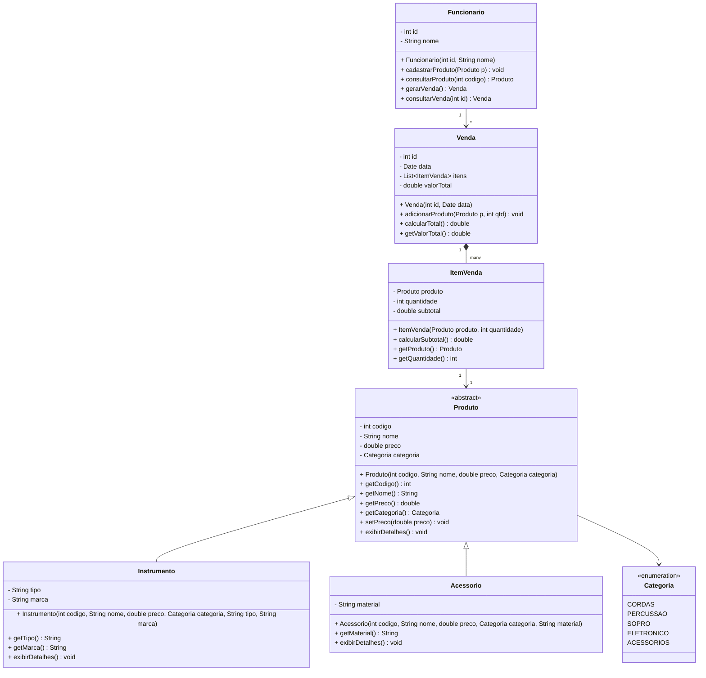

# 📝 Tarefa – Loja de Música em Java

## 🎯 Objetivo
Implementar um sistema simples de **loja de música** em Java, utilizando **herança, associação, composição e enum** com base no **diagrama de classes** fornecido.  

---

## 📊 Diagrama de Classes



---

## 🛠️ Instruções de Implementação

1. **Crie todas as classes e o enum** conforme o diagrama:  
   - `Produto` (classe **abstrata**)  
   - `Instrumento` (herda de Produto)  
   - `Acessorio` (herda de Produto)  
   - `ItemVenda`  
   - `Venda`  
   - `Funcionario`  
   - `Categoria` (**enum**)  

2. Cada classe deve ter:  
   - **Atributos privados**.  
   - **Construtor** conforme o diagrama.  
   - **Métodos getters e setters** quando necessário.  
   - O método `exibirDetalhes()` para mostrar informações no console.  

3. A classe `Produto` deve ser abstrata e incluir um atributo do tipo `Categoria`.  

4. A classe `Venda` deve:  
   - Permitir **adicionar produtos** (criando `ItemVenda`).  
   - Ter um método `calcularTotal()` que soma todos os subtotais.  

5. A classe `Funcionario` deve simular:  
   - **Cadastrar produtos** em memória (pode ser uma lista ou array).  
   - **Consultar produto** por código.  
   - **Gerar venda**.  
   - **Consultar venda** por id.  

6. Crie uma classe `Main` com o método `main(String[] args)` para testar o sistema:  
   - Cadastre alguns produtos (`Instrumento` e `Acessorio`) com categorias do `enum`.  
   - Crie uma venda adicionando produtos.  
   - Exiba o valor total da venda.  
   - Consulte e exiba os produtos e vendas cadastrados.  

---

## 📌 O que deve ser entregue

- Arquivos Java:  
  - `Produto.java`  
  - `Instrumento.java`  
  - `Acessorio.java`  
  - `ItemVenda.java`  
  - `Venda.java`  
  - `Funcionario.java`  
  - `Categoria.java` (**enum**)  
  - `Main.java`  

- O sistema deve **compilar e rodar** sem erros.  
- No console deve ser possível ver:  
  - Produtos cadastrados.  
  - Vendas realizadas.  
  - Valor total calculado da venda.  

---

## ✅ Critérios de Avaliação

- Implementação fiel ao diagrama.  
- Uso correto de **herança, enum e composição**.  
- Código organizado, com nomes claros.  
- Funcionamento completo do fluxo: **cadastrar → vender → consultar**.  

---

## 📂 Esqueleto do Código em Java

```java
// Categoria.java
public enum Categoria {
    CORDAS, PERCUSSAO,
}

// Produto.java
public abstract class Produto {
    private int codigo;
       
    private Categoria categoria;

    public Produto(int codigo, String nome, double preco, Categoria categoria) {
        this.codigo = codigo;
        this.nome = nome;
        this.preco = preco;
        this.categoria = categoria;
    }

    public int getCodigo() { return codigo; }
    public String getNome() { return nome; }
    
    public Categoria getCategoria() { return categoria; }

    public void setPreco(double preco) { this.preco = preco; }

    public abstract void exibirDetalhes();
}

// Instrumento.java
public class Instrumento extends Produto {
    private String tipo;
    private String marca;

    public Instrumento(int codigo, String nome, double preco, Categoria categoria, String tipo, String marca) {
        super(codigo, nome, preco, categoria);
        this.tipo = tipo;
        this.marca = marca;
    }

    @Override
    public void exibirDetalhes() {
        System.out.println("Instrumento: " + getNome() + " - Marca: " + marca + " (" + tipo + ")");
    }
}

// Acessorio.java
public class Acessorio Produto {
    private String material;

    public Acessorio(int codigo, String nome, double preco, Categoria categoria, String material) {
        super(codigo, nome, preco, categoria);
        this.material = material;
    }

    @Override
    public void exibirDetalhes() {
        System.out.println("Acessório: " + getNome() + " - Material: " + material);
    }
}

// ItemVenda.java
public class ItemVenda {
    private Produto produto;
    private double subtotal;

    public ItemVenda(Produto produto, int quantidade) {
        this.produto = produto;
        this.quantidade = quantidade;
        this.subtotal = calcularSubtotal();
    }

    public double calcularSubtotal() {
        return produto.getPreco() * quantidade;
    }

    public Produto getProduto() { return produto; }
    public double getSubtotal() { return subtotal; }
}

// Venda.java
import java.util.ArrayList;
import java.util.Date;
import java.util.List;

public class Venda {
    private int id;
    private Date data;
    private List<ItemVenda> itens;

    public Venda(int id, Date data) {
        this.id = id;
        this.data = data;
        this.itens = new ArrayList<>();
    }

    public void adicionarProduto(Produto p, int qtd) {
        ItemVenda item = new ItemVenda(p, qtd);
        itens.add(item);
        calcularTotal();
    }

    public void calcularTotal() {
        valorTotal = 0;
        for (ItemVenda item : itens) {
            valorTotal += item.getSubtotal();
        }
    }

    public double getValorTotal() {
        return valorTotal;
    }

    public void exibirItens() {
        for (ItemVenda item : itens) {
            item.getProduto().exibirDetalhes();
            System.out.println("Quantidade: " + item.getQuantidade() + " | Subtotal: R$ " + item.getSubtotal());
        }
    }
}

// Funcionario.java
import java.util.ArrayList;
import java.util.List;

public class Funcionario {
    private int id;
    private List<Produto> produtos;
    private List<Venda> vendas;

    public Funcionario(int id, String nome) {
        this.id = id;
        this.nome = nome;
        this.produtos = new ArrayList<>();
        this.vendas = new ArrayList<>();
    }

    public void cadastrarProduto(Produto p) {
        produtos.add(p);
    }

    public Produto consultarProduto(int codigo) {
        for (Produto p : produtos) {
            if (p.getCodigo() == codigo) return p;
        }
        return null;
    }

    public Venda gerarVenda(int idVenda) {
        Venda v = new Venda(idVenda, new java.util.Date());
        vendas.add(v);
        return v;
    }

    public Venda consultarVenda(int idVenda) {
        for (Venda v : vendas) {
            if (v.getId() == idVenda) return v;
        }
        return null;
    }
}

// Main.java
public class Main {
    public static void main(String[] args) {
        Funcionario f1 = new Funcionario(1, "João");

        Produto guitarra = new Instrumento(101, "Guitarra", 1500.0, Categoria.CORDAS, "Cordas", "Fender");
        Produto baqueta = new Acessorio(201, "Baqueta", 50.0, Categoria.ACESSORIOS, "Madeira");

        f1.cadastrarProduto(guitarra);
        f1.cadastrarProduto(baqueta);

        Venda venda1 = f1.gerarVenda(1);
        venda1.adicionarProduto(guitarra, 1);
        venda1.adicionarProduto(baqueta, 2);

        System.out.println("Itens da venda:");
        venda1.exibirItens();
        System.out.println("Valor total da venda: R$ " + venda1.getValorTotal());
    }
}
```

---

👉 **Dica do Prof. Marcos**: comece pelas classes mais simples (`Produto`, `Instrumento`, `Acessorio`, `Categoria`), depois faça `ItemVenda` e `Venda`, e só no final implemente o `Funcionario` e a `Main`.  
